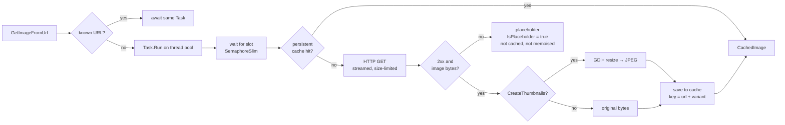

# BatchImageLoaderLibrary

**Load thousands of images fast, once, and keep them.**
A concurrent batch image loader for .NET desktop apps on Windows: request de-duplication, a hard concurrency cap, optional thumbnails, and a persistent cache (SQLite or filesystem) so the next run is instant.

[](https://www.nuget.org/packages/BatchImageLoaderLibrary)
[](https://www.nuget.org/packages/BatchImageLoaderLibrary)
[](https://github.com/n1tr3x/BatchImageLoaderLibrary/actions/workflows/ci.yml)
[](#requirements)
[](LICENSE)

```csharp
BatchImageLoader.StorageType = StorageType.DB;
BatchImageLoader.Instance.ThumbnailWidth  = 160;
BatchImageLoader.Instance.ThumbnailHeigth = 160;

CachedImage[] thumbs = await Task.WhenAll(urls.Select(BatchImageLoader.Instance.GetImageFromUrl));
```

That is the whole API for the common case. Everything else on this page is optional.

---

## Table of contents

- [Why](#why)
- [Install](#install)
- [Quick start](#quick-start)
  - [WinForms gallery](#winforms-gallery)
  - [WPF and MVVM](#wpf-and-mvvm)
  - [Console downloader](#console-downloader)
- [Configuration](#configuration)
- [Placeholder: when a load fails](#placeholder-when-a-load-fails)
- [Cache](#cache)
  - [Backends](#backends)
  - [Where the cache lives](#where-the-cache-lives)
  - [Thumbnail variants](#thumbnail-variants)
  - [Invalidation](#invalidation)
  - [Warm start](#warm-start)
- [Network](#network)
- [Progress counters](#progress-counters)
- [Diagnostics log](#diagnostics-log)
- [How it works](#how-it-works)
- [API reference](#api-reference)
- [Requirements and limitations](#requirements-and-limitations)
- [Development](#development)
- [Versioning and releases](#versioning-and-releases)
- [License](#license)

---

## Why

You have a long list of image URLs, a gallery grid, a photo picker, a scraper. You want them on screen quickly, you do not want to download the same URL twice, and you do not want to download anything at all on the second run.

| Problem | What the library does |
|---|---|
| The same URL is requested from ten places at once | **De-duplicated.** One download, every caller awaits the same result. No polling, no lock-ups. |
| 2 000 URLs fired at once melt the network stack | **Hard concurrency cap** (`MaxThreadsCount`) with a semaphore, not a thread count guess. |
| Sockets exhausted, `WSAEACCES` on Hyper-V/WSL machines | **One pooled `HttpClient`** with a connect callback that avoids WinNAT reserved port ranges. |
| Every restart re-downloads everything | **Persistent cache**: SQLite (single file) or filesystem (one file per image), your choice. |
| The grid needs 120×120, the export needs originals | **Per-size cache keys.** Thumbnails of different sizes for one URL coexist. |
| One broken URL should not break the batch | **Never throws on network errors.** A failed load returns a built-in placeholder, flagged with `IsPlaceholder`, not written to disk, retried next time. |
| A CDN answers `200 OK` with an HTML captcha page | **Content sniffing.** Bytes that are not an image never enter the cache. |
| Heavy work lands on the UI thread | **Everything runs on the thread pool.** Cache reads, HTTP, GDI+ resizing and cache writes never touch the caller's `SynchronizationContext`. |
| A malicious or wrong URL points at a 4 GB file | **Size limit** (`MaxImageBytes`) enforced while streaming. |

## Install

```bash
dotnet add package BatchImageLoaderLibrary
```

```xml
<PackageReference Include="BatchImageLoaderLibrary" Version="1.1.0" />
```

Package Manager Console:

```powershell
Install-Package BatchImageLoaderLibrary
```

The consumer project must target Windows, for example `net8.0-windows` (see [Requirements](#requirements-and-limitations)).

## Quick start

### WinForms gallery

```csharp
using BatchImageLoaderLibrary;

// Configure once, before the first load.
BatchImageLoader.StorageType = StorageType.FILE;          // or StorageType.DB (default)
BatchImageLoader.Instance.MaxThreadsCount = 16;
BatchImageLoader.Instance.ThumbnailWidth  = 120;
BatchImageLoader.Instance.ThumbnailHeigth = 120;          // yes, "Heigth" — kept for compatibility

async Task FillGalleryAsync(IEnumerable<string> urls)
{
    Task<CachedImage>[] loads = urls.Select(BatchImageLoader.Instance.GetImageFromUrl).ToArray();

    foreach (Task<CachedImage> load in loads)
    {
        CachedImage image = await load;                    // continues on the UI thread
        using Image? bitmap = image.ToImage();
        if (bitmap != null)
            imageList.Images.Add(bitmap);                  // ImageList copies the bitmap
    }
}
```

### WPF and MVVM

`ToBitmapImage()` returns a frozen `BitmapImage`: it can be created on a background thread and assigned to a bound property without a dispatcher.

```csharp
public sealed class PhotoViewModel : ObservableObject
{
    private ImageSource? thumbnail;
    public ImageSource? Thumbnail { get => thumbnail; private set => SetProperty(ref thumbnail, value); }

    public async Task LoadAsync(string url)
    {
        CachedImage image = await BatchImageLoader.Instance.GetImageFromUrl(url);
        Thumbnail = image.IsPlaceholder ? null : image.ToBitmapImage();
    }
}
```

```xml
<Image Source="{Binding Thumbnail}" Width="120" Height="120" Stretch="UniformToFill" />
```

### Console downloader

Full-size originals, no thumbnails, no cache, and placeholders skipped instead of being saved as photos.

```csharp
BatchImageLoader.Instance.CreateThumbnails = false;
BatchImageLoader.Instance.NeedSaveToCache  = false;
BatchImageLoader.Instance.MaxThreadsCount  = 8;

int saved = 0, failed = 0;
await Task.WhenAll(urls.Select(async (url, i) =>
{
    CachedImage image = await BatchImageLoader.Instance.GetImageFromUrl(url);
    if (image.IsPlaceholder)
    {
        Interlocked.Increment(ref failed);
        return;
    }
    await File.WriteAllBytesAsync($"photos/{i:D5}.jpg", image.Data!);
    Interlocked.Increment(ref saved);
}));

Console.WriteLine($"saved {saved}, failed {failed}");
```

## Configuration

Everything is set on `BatchImageLoader.Instance` (per-request options) or on `BatchImageLoader` itself (process-wide statics). Set them **before the first `GetImageFromUrl`**.

| Member | Default | When it is read | Description |
|---|---|---|---|
| `BatchImageLoader.StorageType` | `DB` | live | `DB` (single SQLite file) or `FILE` (one file per image). Switching after start recreates the backend. |
| `BatchImageLoader.CacheDirectory` | `<app dir>\cache` | live | Directory for the `FILE` backend. |
| `BatchImageLoader.DatabasePath` | `<app dir>\BatchImageLoaderLibraryCache.sqlite` | live | File for the `DB` backend. |
| `Instance.MaxThreadsCount` | `64` | **once**, at first load | Maximum concurrent loads. Later changes are ignored. |
| `Instance.CreateThumbnails` | `true` | per request | Resize to `ThumbnailWidth × ThumbnailHeigth`. `false` caches the original bytes under the `orig` variant. |
| `Instance.ThumbnailWidth` | `120` | per request | Thumbnail width. |
| `Instance.ThumbnailHeigth` | `120` | per request | Thumbnail height. The misspelling is part of the public API. |
| `Instance.NeedSaveToCache` | `true` | per request | Persist successful loads. |
| `BatchImageLoader.RequestTimeout` | `30 s` | per request | Whole request: connect, headers and body. |
| `BatchImageLoader.MaxImageBytes` | `64 MB` | per request | Larger responses are treated as failed loads. |
| `BatchImageLoader.HttpHandler` | `null` | **once**, at first load | Custom `HttpMessageHandler` (proxy, headers, tests). `null` = built-in `SocketsHttpHandler`. |
| `BatchImageLoader.LogFile` | `null` | live | Path to a diagnostics log. `null` = off. |

Do not change `CreateThumbnails` or the thumbnail size while loads are in flight: one process, one configuration. Each request snapshots the settings when it starts, so a change affects only requests issued after it.

## Placeholder: when a load fails

`GetImageFromUrl` **never throws because of the network**. Timeout, DNS failure, `404`, `500`, a body that is not an image, a response over the size limit, or bytes GDI+ cannot decode all produce the same result: a `CachedImage` holding the embedded `404.png` with `IsPlaceholder == true`.

```csharp
CachedImage image = await BatchImageLoader.Instance.GetImageFromUrl(url);
if (image.IsPlaceholder)
{
    // show a "retry" tile, log, skip — your call
}
```

What happens to a failed URL:

- it is **not written** to the persistent cache;
- it is **not kept in memory** either: callers already awaiting get the placeholder, the next `GetImageFromUrl(url)` retries from scratch;
- `Loaded()` still returns `true` (the placeholder has bytes). Use `IsPlaceholder`, not `Loaded()`, to detect failure.

The only exceptions that reach the caller are storage errors (cache directory not writable, SQLite file locked). They surface from the awaited task; the URL is evicted so a retry is possible.

## Cache

### Backends

| | `StorageType.DB` (default) | `StorageType.FILE` |
|---|---|---|
| Layout | one `.sqlite` file, table `images(path, variant, data)` | one `{sha1(url)}_{variant}.jpg` per image |
| Concurrency | WAL journal, `busy_timeout`, one pooled connection per operation | plain files |
| Original URL | column `path` | NTFS alternate data stream `filename` (UTF-8) |
| Requirements | none | **NTFS only** (ADS): not exFAT, FAT, network shares, archives |
| Wipe (`ClearCache`) | `DELETE` + `VACUUM` | deletes only its own `{40 hex}_{variant}.jpg` files, keeps the directory and anything else in it |
| Good for | most apps, portable single-file cache | inspecting the cache by eye, huge caches |

The SQLite schema is versioned (`PRAGMA user_version`); an incompatible older cache is reset automatically.

### Where the cache lives

Paths are resolved **once** and are absolute. The defaults sit next to the executable (`AppContext.BaseDirectory`), so an `OpenFileDialog`, a shortcut with another *Start in* folder or the Task Scheduler cannot move the cache under your feet.

```csharp
BatchImageLoader.CacheDirectory = Path.Combine(
    Environment.GetFolderPath(Environment.SpecialFolder.LocalApplicationData), "MyApp", "thumbs");

BatchImageLoader.DatabasePath = Path.Combine(
    Environment.GetFolderPath(Environment.SpecialFolder.LocalApplicationData), "MyApp", "thumbs.sqlite");
```

### Thumbnail variants

The cache key is `(url, variant)`, where the variant is `"120x120"`-style for thumbnails or `"orig"` for full-size bytes. Two apps, or two runs with different sizes, can share one cache without overwriting each other. `ClearCacheForUrl` removes every variant of the URL.

### Invalidation

```csharp
BatchImageLoader.ClearCacheForUrl(url);   // memory + disk, all variants; next call reloads
BatchImageLoader.ClearCache();            // wipe everything
```

Both work in the current session: the next `GetImageFromUrl` for that URL goes to the network again. Both are safe to call before the first load.

### Warm start

Results are kept in memory for the lifetime of the process (no eviction). To pre-fill that memory from disk at start-up:

```csharp
await BatchImageLoader.Instance.LoadFromCache();   // reads the current variant only
```

This is optional. Without it every URL is still served from disk on first request, one read per URL.

## Network

- One `HttpClient` for the process, `PooledConnectionLifetime = 5 min`, HTTP keep-alive, no socket churn.
- Outgoing sockets are bound to a local port in `20000..48999`, below the WinNAT reserved ranges used by Hyper-V, WSL and Docker. This is the fix for `SocketException 10013 (WSAEACCES)` on such machines.
- Each connect attempt has its own 8 s deadline and is retried up to 3 times inside the overall `RequestTimeout`.
- The body is streamed with a running size check; `Content-Length` is not trusted.
- The first bytes are checked against image signatures (JPEG, PNG, GIF, BMP, WebP, TIFF, ICO, HEIF/AVIF containers). `Content-Type` is ignored on purpose: CDNs lie.

Need a `Referer`, a `User-Agent`, cookies or a proxy? Plug in a handler **before the first load**:

```csharp
sealed class WithHeaders : DelegatingHandler
{
    public WithHeaders() : base(new SocketsHttpHandler { PooledConnectionLifetime = TimeSpan.FromMinutes(5) }) { }

    protected override Task<HttpResponseMessage> SendAsync(HttpRequestMessage request, CancellationToken ct)
    {
        request.Headers.Referrer = new Uri("https://example.com/");
        request.Headers.UserAgent.ParseAdd("MyGallery/1.0");
        return base.SendAsync(request, ct);
    }
}

BatchImageLoader.HttpHandler = new WithHeaders();
```

A custom handler replaces the built-in one entirely, including the local-port binding.

## Progress counters

All on `BatchImageLoader.Instance`, all read-only, all cheap.

| Counter | Meaning |
|---|---|
| `ImagesInQueue` | waiting for a free slot |
| `ThreadCount` | holding a slot right now (cache read, HTTP, resize, cache write) |
| `ImagesLoading` | inside the HTTP request |
| `ImagesProcessing` | `ImagesInQueue + ImagesLoading` |
| `ImagesLoaded` | URLs known in memory: in flight, completed, or pre-loaded |

They describe the library's own work, not your continuations. To wait for results use `Task.WhenAll`, not a counter.

## Diagnostics log

Off by default. Point it at a file and every step is appended with a timestamp and thread id: request, de-duplication, queue wait, connect attempts with the local port, HTTP timing and size, cache hit or miss, thumbnailing, placeholder decisions.

```csharp
BatchImageLoader.LogFile = @"C:\logs\images.log";   // on
BatchImageLoader.LogFile = null;                    // off
```

```
00:11:59.559 [t01] slot   : https://…/FuUX96lEgdw.jpg?… (waited=0ms, threads=1)
00:11:59.570 [t01] cache  : https://…/FuUX96lEgdw.jpg?… -> miss
00:11:59.637 [t05] connect: sun9-24.userapi.com:443 attempt 1/3 from [::ffff:0:0]:27043
00:12:00.513 [t10] conn-ok: sun9-24.userapi.com via [::ffff:192.168.18.85]:27043 (attempt 1)
00:12:00.829 [t10] http-ok: https://…/FuUX96lEgdw.jpg?… -> 160172 bytes in 1258ms
00:12:00.849 [t10] thumb  : https://…/FuUX96lEgdw.jpg?… 160172 -> 3731 bytes (120x120)
00:12:00.860 [t10] done   : https://…/FuUX96lEgdw.jpg?… (total=1300ms, 3731 bytes)
```

The log is a diagnostic aid: it flushes every line and noticeably slows heavy batches. URLs are logged verbatim, signed CDN links included, so do not ship these files around.

## How it works



1. `GetImageFromUrl(url)` returns a `Task<CachedImage>` from a `ConcurrentDictionary<string, Lazy<Task<CachedImage>>>`. The first caller starts the load; everyone else, now or later, awaits the same task.
2. The load runs entirely on the thread pool. The caller's `SynchronizationContext` is never captured, so a WinForms or WPF UI thread does nothing but receive the result.
3. A `SemaphoreSlim` caps how many loads are active at once. The slot covers the whole pipeline: cache read, HTTP, resize, cache write.
4. On a cache miss the shared `HttpClient` streams the body with a size limit, the bytes are checked against image signatures, optionally resized with GDI+, and written to the cache under `(url, variant)`.
5. A failed load yields the placeholder for the callers already waiting, is not persisted, and is dropped from memory so the next call retries.

## API reference

### `BatchImageLoader`

```csharp
static BatchImageLoader Instance { get; }

// per-request options
int  MaxThreadsCount  { get; set; }   // 64, captured at first load
bool CreateThumbnails { get; set; }   // true
int  ThumbnailWidth   { get; set; }   // 120
int  ThumbnailHeigth  { get; set; }   // 120 (sic)
bool NeedSaveToCache  { get; set; }   // true

// process-wide
static StorageType         StorageType    { get; set; }   // DB
static string              CacheDirectory { get; set; }   // <app dir>\cache
static string              DatabasePath   { get; set; }   // <app dir>\BatchImageLoaderLibraryCache.sqlite
static HttpMessageHandler? HttpHandler    { get; set; }   // null = built-in
static TimeSpan            RequestTimeout { get; set; }   // 30 s
static long                MaxImageBytes  { get; set; }   // 64 MB
static string?             LogFile        { get; set; }   // null = off

Task<CachedImage> GetImageFromUrl(string url);   // de-duplicated; never throws on network errors
Task LoadFromCache();                            // pre-load the current variant into memory

static void ClearCacheForUrl(string url);        // memory + disk, all variants
static void ClearCache();                        // wipe everything
static byte[]? CreateThumbnail(byte[] image, int h = 120, int w = 120);   // note the (h, w) order

// counters
int ImagesLoaded, ImagesLoading, ImagesInQueue, ImagesProcessing, ThreadCount { get; }
```

### `CachedImage`

```csharp
byte[]? Data          { get; set; }
bool    IsPlaceholder { get; }        // true = load failed, Data is the embedded 404.png

bool    Loaded();                     // has non-empty data (true for the placeholder too)
int     Size();                       // byte length, 0 if empty
byte[]? ToByteArray();                // same reference as Data
Image?  ToImage();                    // System.Drawing — WinForms; dispose it; null if undecodable
BitmapImage? ToBitmapImage();         // WPF, frozen, thread-safe; null if undecodable
```

### `StorageType`

```csharp
enum StorageType { FILE, DB }
```

## Requirements and limitations

- **.NET 8**, `net8.0-windows`. Consumers must target Windows too (`net8.0-windows`, `net9.0-windows`, `net10.0-windows`). A plain `net8.0` project cannot reference the package.
- **Windows** only: GDI+ (`System.Drawing`) for thumbnails, WPF imaging for `ToBitmapImage()`, NTFS alternate data streams for the `FILE` backend. The package brings a `FrameworkReference` to `Microsoft.WindowsDesktop.App.WPF`; WinForms and console apps get it transitively and need the Windows Desktop runtime installed.
- **One loader per process.** Configuration is global; there is no instance isolation. Tests inside the library reset the singleton through an internal hook.
- **No eviction.** Every loaded image stays in memory until the process exits. Fine for thumbnails; for full-size originals prefer `NeedSaveToCache = false` plus saving to disk yourself.
- **No `CancellationToken`** on `GetImageFromUrl` yet. Closing a form does not abort queued loads; they finish within `RequestTimeout` each.
- Thumbnails are resized **without preserving aspect ratio**, PNG transparency becomes black in the JPEG, EXIF orientation is not applied.
- `ThumbnailHeigth` and `CreateThumbnail(image, h, w)` keep their historical spelling and argument order.

## Development

```bash
git clone https://github.com/n1tr3x/BatchImageLoaderLibrary.git
cd BatchImageLoaderLibrary
dotnet test BatchImageLoaderLibrary.sln -c Release
```

The test suite runs without network: the transport is replaced through `BatchImageLoader.HttpHandler`, the cache lives in a temporary directory. It covers de-duplication, the concurrency cap, placeholder semantics, content sniffing, size limits, cache invalidation, warm start, thumbnail variants, backend parity and non-ASCII URLs.

CI ([`ci.yml`](.github/workflows/ci.yml)) builds and tests on `windows-latest` for every push and pull request.

## Versioning and releases

- The version lives in one place: `<Version>` in [`BatchImageLoaderLibrary.csproj`](BatchImageLoaderLibrary/BatchImageLoaderLibrary.csproj).
- A release is a git tag `vX.Y.Z` that matches it. CI checks the match, builds, runs the tests, and only then pushes the package (with symbols) to [nuget.org](https://www.nuget.org/packages/BatchImageLoaderLibrary).
- Changes per version: [CHANGELOG.md](CHANGELOG.md).

```bash
git tag v1.1.0
git push origin v1.1.0
```

## License

[MIT](LICENSE) © n1tr3x
